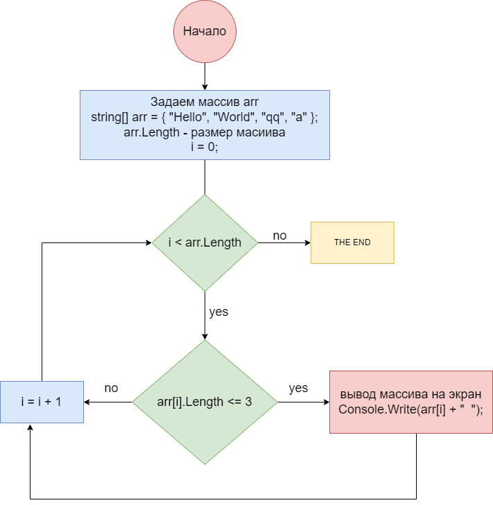

# TestWork-1
Контрольная работа за 1 четверть

## Составляем алгоритм решения задачи

**Блок-схема**


*1. Задаем массив из элементов типа данных  **string**.*

```c#
string[] arr = { "Hello", "World", "qq", "a" };
```

*2. Анализируем длину каждого элемента массива*

```c#
if (arr[i].Length <= 3)
```
3 в случае если длина элемента меньше либо равна трем, тогда выводим элемент в консоль

```c#
Console.Write(arr[i] + "  ");
```